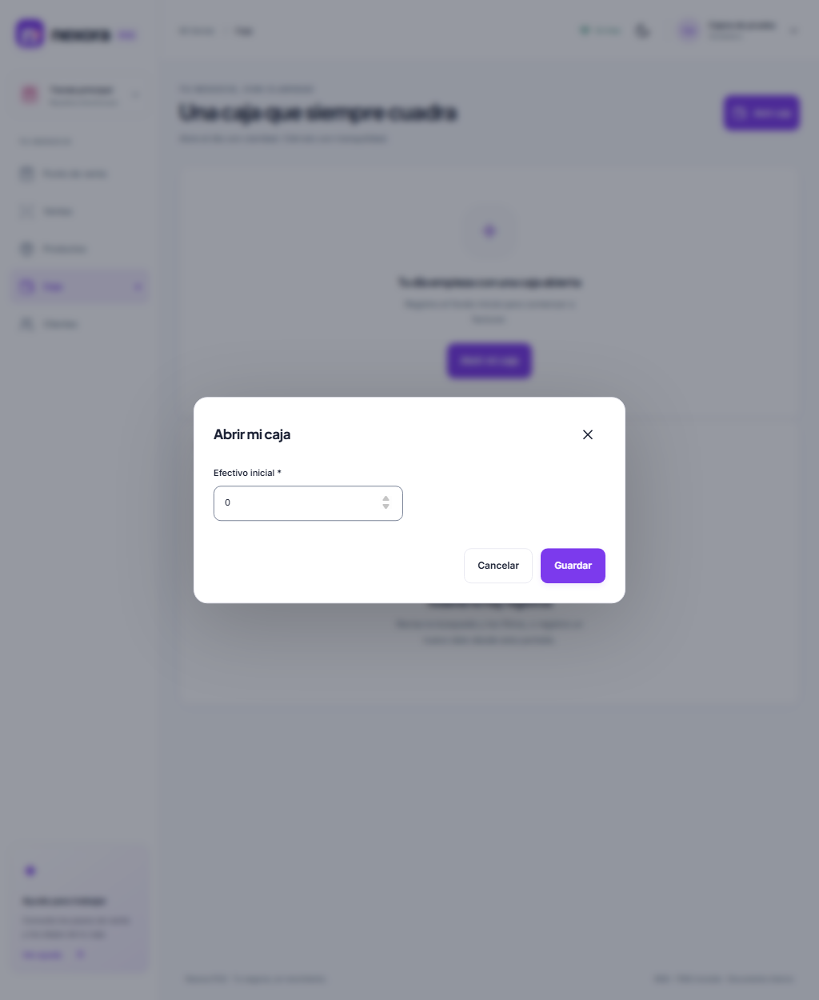
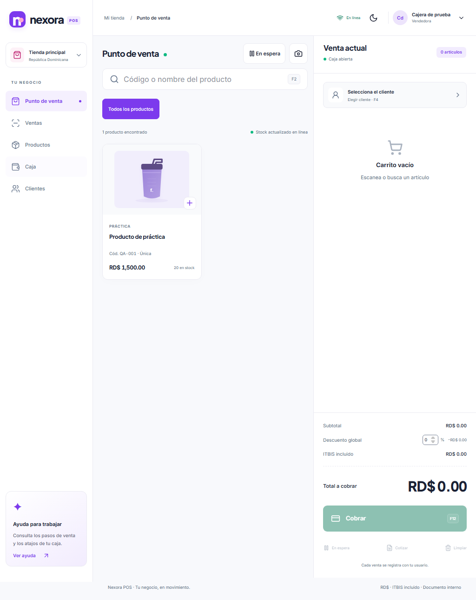
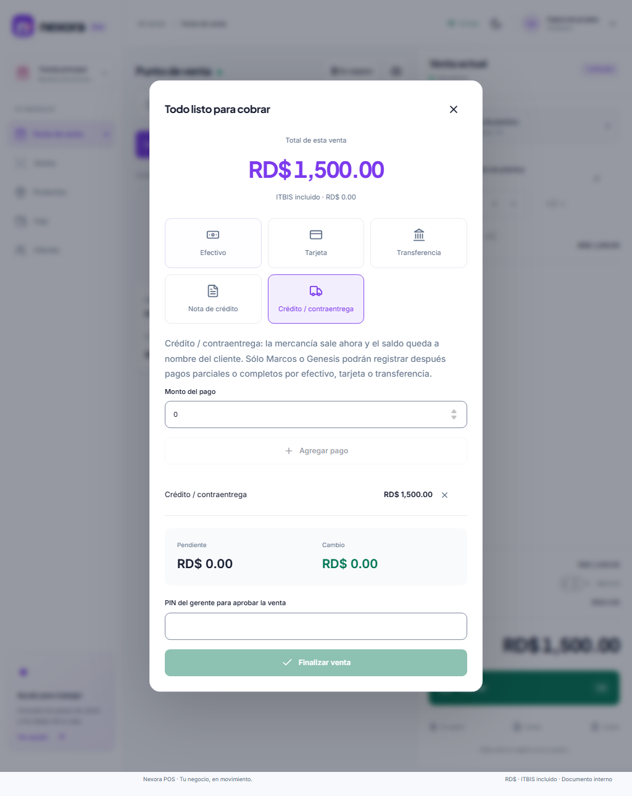
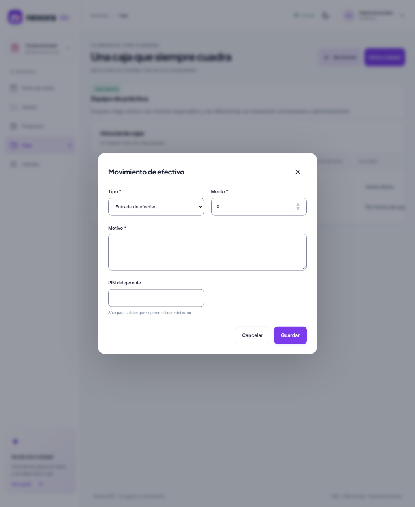
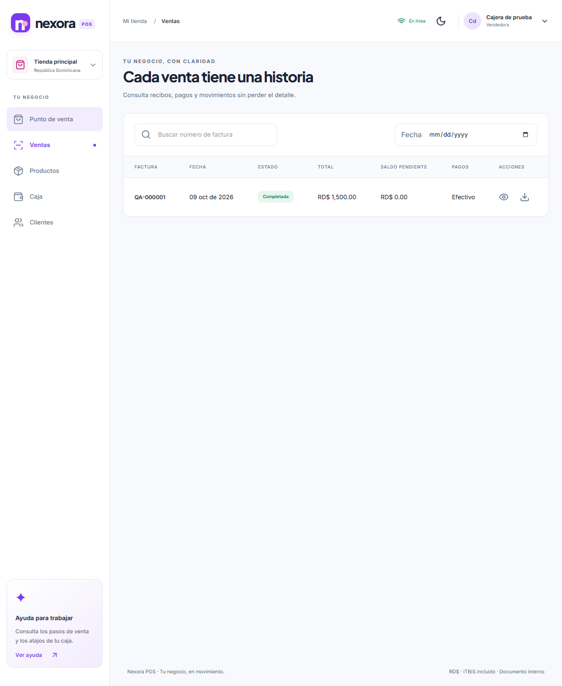
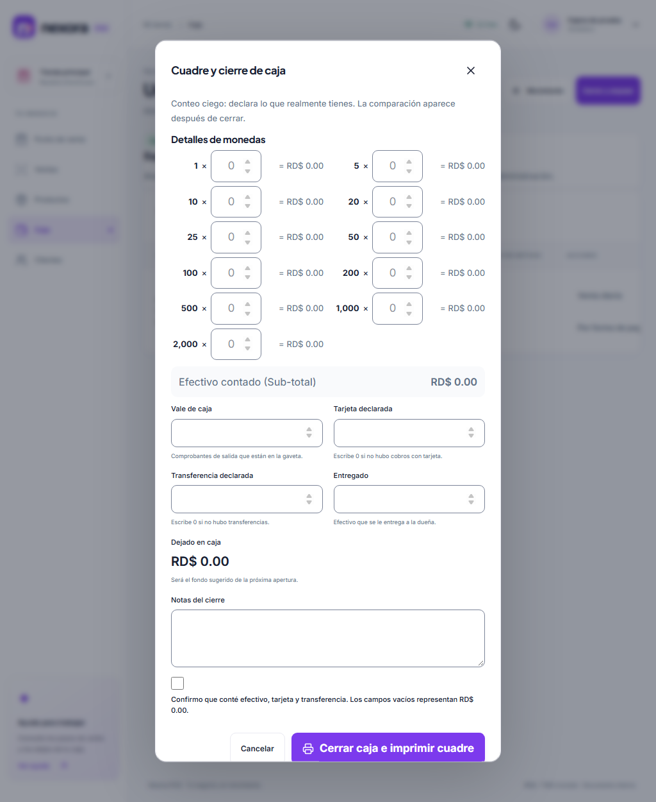
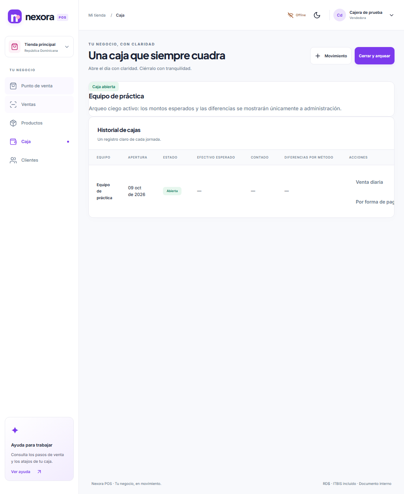

# Manual de la cajera — Nexora POS

Una tarea por página. **Datos ficticios** en las capturas de la aplicación local; no muestran cuentas ni ventas reales. Los importes de ejemplo no son límites del negocio. Sin NCF, el ticket dice **DOCUMENTO NO FISCAL – NO ES COMPROBANTE FISCAL**.

**Estado de las imágenes:** corresponden al lote P2 anterior. Su actualización está pendiente de integrar `claude/g-ui` y `claude/g-privacy`, conforme a las órdenes v3.6. No constituyen evidencia de la interfaz final. Procedimiento de renovación: [CAPTURAS_MANUAL.md](CAPTURAS_MANUAL.md).

## 1. Entrar y abrir caja

1. Escribe tu usuario y contraseña. Si pide cambiarla, completa las cinco reglas y confirma tu nueva clave; no la compartas. Para cambiarla otro día, abre el menú de tu nombre (arriba a la derecha) → **Cambiar mi contraseña**. Si la olvidaste, pide a la administración **Restablecer contraseña**. Si solo quedó bloqueada por intentos fallidos y la recuerdas, espera 15 minutos o pide lo mismo a la administración.
2. En **Caja**, pulsa **Abrir mi caja** y cuenta el efectivo físico que recibes como fondo inicial.
3. Escribe el monto y **Guardar**. Si es menor que el fondo sugerido, explica la diferencia y pide al gerente su PIN cuando se solicite.
4. Si ya existe caja abierta, no la abras otra vez: revisa Caja y llama a gerencia. Cada persona usa su usuario y equipo aprobado.

**Comprueba:** Caja abierta y tu nombre. Si el equipo requiere aprobación, gerencia lo aprueba en Configuración > Equipos. No abras caja solo para consultar.

## 2. Preparar una venta

1. En **Punto de venta**, busca nombre/código o escanea; confirma talla, color o tono.
2. Toca el artículo para agregarlo. Revisa cantidad con **− / +**, precio y existencia.
3. Selecciona al cliente (F4). Si no existe, usa **Nuevo cliente aquí mismo**, escribe el nombre y **Guardar y usar cliente**. Los demás datos son opcionales.
4. Revisa el total. No uses otro cliente o producto para saltar un error de stock.

**Si falta el artículo:** prueba menos palabras o su código. Si no aparece, avisa a gerencia; no sustituyas por otro producto.

## 3. Cobrar, descuento y PIN

1. Pulsa **Cobrar** (F12). Elige **Efectivo**, **Tarjeta** o **Transferencia**, indica monto y **Agregar pago**.
2. En efectivo escribe lo recibido y entrega el cambio indicado. En tarjeta, solo últimos cuatro dígitos y aprobación; en transferencia, banco y referencia.
3. Para pago mixto, agrega cada método hasta que Pendiente sea RD$ 0.00. Pulsa **Finalizar venta** una sola vez y espera confirmación.
4. En **Crédito / contraentrega**, identifica al cliente y confirma el acuerdo con gerencia. El saldo pendiente no es efectivo cobrado. Si pide **PIN del gerente para aprobar la venta**, el gerente lo escribe personalmente.
5. Un descuento sobre tu autorización requiere motivo y PIN de gerente. No dividas facturas para evitar controles. Administración (Marcos o Génesis) registra y verifica luego los abonos del crédito.
6. Si rechaza límite o autorización, consulta a gerencia. Esta pantalla no pide vencimiento del crédito.

**Importante:** crédito y autorizaciones requieren internet. Nunca guardes ni compartas el PIN. Si se pierde la respuesta, sigue la página 8.

## 4. Retirar efectivo

1. En **Caja**, con tu caja abierta, pulsa **Movimiento**.
2. En Tipo elige **Salida de efectivo**. Escribe monto positivo y motivo claro.
3. Pide al gerente que escriba su PIN si las salidas acumuladas del turno superan el límite configurado.
4. Pulsa **Guardar** una sola vez. Entrega solo lo autorizado y conserva el comprobante según el procedimiento de la tienda.

**No confundas:** retirar dinero no anula una venta. Si falta efectivo o falla el PIN, no alteres el monto para saltar controles; avisa a gerencia.

## 5. Recibir una devolución

1. Pide el comprobante y localiza la operación en **Ventas**. No crees una venta negativa.
2. Llama a gerencia para comprobar plazo y condiciones configurados por la tienda.
3. La persona con permiso de gerencia abre su propia caja para procesar la devolución, pulsa **Devolver** y selecciona artículo, cantidad, estado, motivo y método de reembolso.
4. No devuelvas más unidades que las vendidas. Suplementos/maquillaje abiertos y artículos dañados no vuelven al stock vendible.
5. Conserva la nota de crédito interna. Entrega un reembolso solo cuando gerencia y sistema lo confirmen; la deuda pendiente se reduce primero.

**Acceso:** la captura es de una cajera. Los botones de devolución dependen del permiso de gerencia; si no aparecen, no es una falla.

## 6. Anular: solo administración (Marcos o Génesis)

1. Avisa a Marcos o Génesis con número de comprobante y motivo del error.
2. Con su cuenta autorizada, ellos buscan la venta en **Ventas**, pulsan **Anular** y confirman el motivo.
3. No borres ni repitas la operación mientras se revisa. La anulación conserva la historia y revierte inventario según corresponda.
4. Si ya tiene devoluciones o abonos, administración determina el procedimiento correcto; no fuerces la anulación. El rol gerente no ve **Anular**: no es una falla.
5. Si la caja original ya cerró y la venta tuvo efectivo, el administrador necesita su propia caja abierta, con efectivo suficiente, para entregar el reembolso y anular. Si el sistema pide abrir caja, no es un error: registra esa salida en el turno que reembolsa y conserva el cierre anterior. Cuando no coinciden esas dos condiciones, la anulación no exige esa caja de reembolso. **Devolver** también requiere caja abierta.

**Tu usuario de cajera no anula ventas.** No pidas ni uses la contraseña de un administrador.

## 7. Cerrar caja ciega e imprimir

1. Conecta internet y sincroniza pendientes antes de cerrar. En **Caja**, pulsa **Cerrar y arquear**.
2. Cuenta físicamente monedas y billetes; escribe cantidades por denominación. No copies un monto esperado: la cajera no debe verlo.
3. Escribe **Tarjeta declarada** y **Transferencia declarada** según comprobantes; escribe 0 si no hubo. **Los campos vacíos representan RD$ 0.00**: nunca se rellenan con lo esperado.
4. Registra vales, efectivo **Entregado** a la dueña y revisa **Dejado en caja**. Explica incidencias en Notas; si pide nota adicional, describe lo ocurrido sin inventar cifras.
5. Marca **Confirmo que conté efectivo, tarjeta y transferencia**. Revisa todo y pulsa **Cerrar caja e imprimir cuadre** una sola vez.
6. Entrega efectivo y comprobantes. Esperados y diferencias solo los revisa gerencia; no cambies conteos para hacerlos coincidir.

**Si no cierra:** sincroniza pendientes y pide ayuda. No abras otra caja para esconder el problema.

## 8. Sin internet o respuesta perdida

1. Si antes del cobro el indicador de la barra superior dice **Offline** (en vez de **En línea**; en el celular solo se ve el ícono de wifi tachado), espera a que vuelva a decir **En línea**. Si tu tienda lo permite, puedes vender en efectivo sin internet: la venta queda guardada en el equipo y el indicador dice **Offline · 1** (el número son las ventas por enviar). Las ventas offline están desactivadas por defecto; solo administración puede habilitarlas en **Configuración → Negocio y reglas → Editar configuración → «Permitir ventas sin conexión»** y asumir revisión posterior.
2. Si ya pulsaste Finalizar y no llegó respuesta, **no vuelvas a cobrar**: la operación puede estar registrada.
3. Al volver internet las ventas se envían solas. Revisa **Caja > Ventas guardadas en este dispositivo** (también se ve sin internet): **Pendiente** espera conexión; pulsa **Sincronizar** si quieres enviarlas ya.
4. Si dice **Requiere revisión**, la fila explica qué pasó y qué hacer. Conserva el dispositivo y sus datos: no borres el navegador ni reinstales la app.
   - **Falta inventario:** gerencia ajusta el inventario y tú pulsas **Reintentar**.
   - **Cambió un precio:** pulsa **Actualizar precios y reintentar**.
   - **No se puede reintentar** (pasaron 48 horas, se desactivaron las ventas sin conexión o no hay unidades): pulsa **Descartar con PIN de gerente**; gerencia escribe el motivo y su PIN en tu equipo. También puede entrar con su usuario en ese equipo y pulsar **Descartar**. Queda en la bitácora con lo que cobraste, y una alerta avisa a gerencia: si el dinero quedó en la gaveta, el cuadre lo mostrará como sobrante.
5. No tramites crédito ni autorizaciones con PIN sin conexión. No cierres caja con operaciones locales por resolver: la ventana de cierre avisa cuántas quedan y qué hacer.
6. Con artículos en el carrito o ventas por enviar, la sesión no se cierra por inactividad. Si recargas la página, el carrito vuelve a aparecer.

**Regla de oro:** si no sabes si se registró una venta, consúltala; nunca la cobres otra vez por intuición.

Las reglas de dinero y permisos de estas ocho tareas se contrastaron con el servidor, no solo con la pantalla: [VERIFICACION_MANUAL.md](VERIFICACION_MANUAL.md). Los nombres de botones y atajos son orientación de interfaz, no garantías de autorización.
